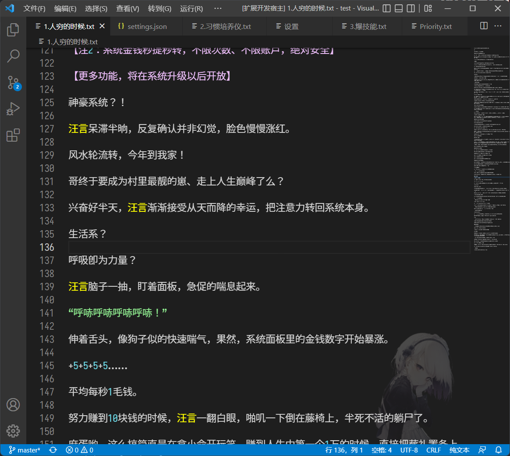
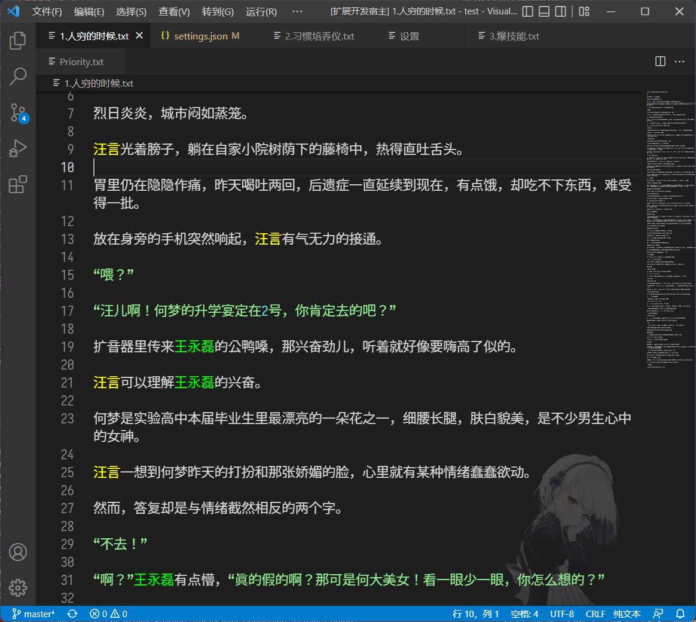

# Noveler —— 一个在 vscode 上码中文小说的插件

## 提供的功能：

### 1. 提供常见语法高亮


提供人物名称高亮

### 2. 自定义人物名称高亮

在settings.json设置，以下是例子

```json
{
	"noveler": {
		"roles": [
			{
				"name": "汪言",
				"color": {
					"light": "#ffff00",
					"dark": "#ffff00"
				}
			},
			{
				"name": "王永磊",
				"color": {
					"dark": "#00ff00",
					"light": "#00ff00"
				}
			}
		]
	}
}
```



### 3. 自定义人物名悬停信息

支持`markdown`语法

在settings.json设置，以下是例子

```json
{
	"noveler": {
		"roles": [
			{
				"name": "汪言",
				"color": {
					"light": "#ffff00",
					"dark": "#ffff00"
				},
				"description": "**男主**，性别为男爱好为女"
			}
		]
	}
}
```


更多功能正在开发中……
